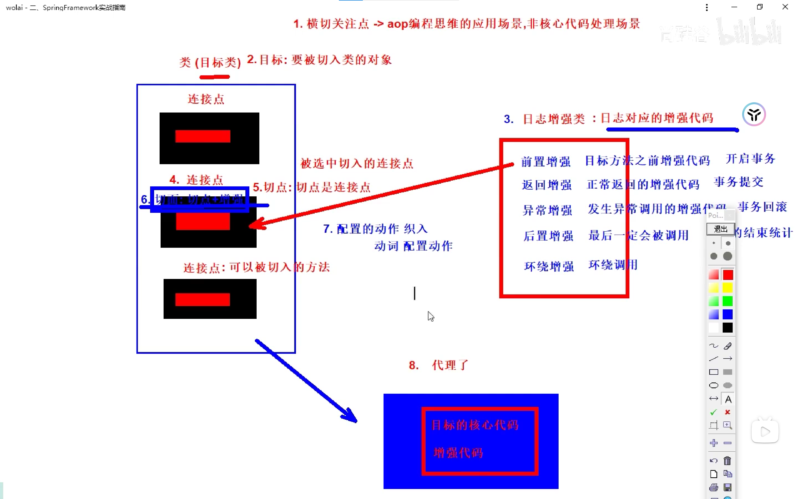

# AOP

AOP可以说是OOP（Object Oriented Programming，面向对象编程）的补充和完善

面向切面编程,是一种横向的操作思维,将代码中的重复的非核心业务提取到一个公共模块,最终利用动态代理技术横向插入到各个方法中。

解决非核心代码冗余

依赖

```xml
<!-- spring-aspects会帮我们传递过来aspectjweaver(注解层) -->
<dependency>
    <groupId>org.springframework</groupId>
    <artifactId>spring-aop</artifactId>
    <version>6.0.6</version>
</dependency>

<dependency>
    <groupId>org.springframework</groupId>
    <artifactId>spring-aspects</artifactId>
    <version>6.0.6</version>
</dependency>
```

需求： 需要在每个方法中，添加控制台输出，输出参数和输出计算后的返回值！

代理模式:

​	二十三种设计模式中的一种，属于结构型模式。它的作用就是通过提供一个代理类，让我们在调用目标方法的时候，不再是直接对目标方法进行调用，而是通过代理类间接调用。让不属于目标方法核心逻辑的代码从目标方法中剥离出来——解耦。调用目标方法时先调用代理对象的方法，减少对目标方法的调用和打扰，同时让附加功能能够集中在一起也有利于统一维护。

静态代理:

写一个静态代理类,通过代理类调用核心业务类，这样很麻烦,静态代理确实实现了解耦,但是代码都写死了,不具备任何灵活性,还得声明多个代理类,产生了大量重复代码。

动态代理:

动态代理技术分类

-   JDK动态代理：JDK原生的实现方式，需要被代理的目标类必须**实现接口**！他会根据目标类的接口动态生成一个代理对象！代理对象和目标对象有相同的接口！（拜把子）
-   cglib：通过继承被代理的目标类实现代理，所以不需要目标类实现接口！（认干爹）


-   JDK动态代理技术实现（了解）

两种方式代理都比较繁琐,我们可以使用SpringAOP框架


1. AOP把软件系统分为两个部分:核心关注点和横切关注点。 
2. 通知(增强),每一个横切关注点上要做的事情都需要写一个方法来实现,这样的方法就叫通知方法

-   前置通知：在被代理的目标方法前执行
-   返回通知：在被代理的目标方法成功结束后执行（**寿终正寝**）
-   异常通知：在被代理的目标方法异常结束后执行（**死于非命**）
-   后置通知：在被代理的目标方法最终结束后执行（**盖棺定论**）
-   环绕通知：使用try...catch...finally结构围绕整个被代理的目标方法，包括上面四种通知对应的所有位置

3. 连接点 joinpoint
4. 切入点 pointcut
5. 切面 aspect 切入点和通知的结合。是一个类。
6. 目标 target

被代理的目标对象。

7. 代理 proxy

向目标对象应用通知之后创建的代理对象。

8. 织入 weave

指把通知应用到目标上，生成代理对象的过程。可以在编译期织入，也可以在运行期织入，Spring采用后者。



## AOP实现

基于注解方式请查看尚硅谷官方文档

```java
/**
 * 定义方法存储增强代码
 * 具体定义几个方法,根据插入的位置决定
 * 使用注解配置,指定目标方法的位置
 * 前置 @Before
 * 后置 @AfterReturning
 * 异常 @AfterThrowing
 * 最后 @After
 * 环绕 @Around
 * try{
 *      前置
 *     目标方法执行
 *     后置
 * }catch(){
 *  异常
 * }finally{
 *     最后
 * }
 * 配置切点表达式【选中插入的方法 切点】
 * 补全注解,@Aspect=切点+增强 @Component
 *  开启aspect注解的支持
 *  @EnableAspectJAutoProxy(配置类上加这个注解)
 */
@Component
@Aspect
public class LOgAdvice {
    @Before("execution(* com.wzy.AOP.CalculatorPureImpl.*(..))")
    public void start(){
        System.out.println("方法开始");
    }
    @After("execution(* com.wzy.AOP.CalculatorPureImpl.*(..))")
    public void after(){
        System.out.println("方法结束");
    }
    @AfterThrowing("execution(* com.wzy.AOP.CalculatorPureImpl.*(..))")
    public void error(){
        System.out.println("方法报错");
    }
}
```

在测试中一定要使用接口进行传值,如果使用实现类,会报错,因为返回的是代理对象(jdbc)。

## 获取通知细节

```java
 @Before("execution(* com.wzy.AOP.CalculatorPureImpl.*(..))")
    public void start(JoinPoint joinPoint){
        //1，获取类的信息 simpleName = CalculatorPureImpl
        String simpleName = joinPoint.getTarget().getClass().getSimpleName();
        //获取方法名 name = add
        String name = joinPoint.getSignature().getName();
        //获取参数列表 args = [Ljava.lang.Object;@2d1dee39
        Object[] args = joinPoint.getArgs();
        //访问修饰符 modi = public abstract
        int modifiers = joinPoint.getSignature().getModifiers();//这就是个数字1025
        String modi = Modifier.toString(modifiers);
    }
//返回的结果
  @AfterReturning(value = "execution(* com.wzy.AOP.CalculatorPureImpl.*(..))",returning = "result")
    public void afterReturning(JoinPoint joinPoint,Object result){
    }
//异常的信息
 @AfterThrowing(value = "execution(* com.wzy.AOP.CalculatorPureImpl.*(..))",throwing = "throwable")
    public void error(JoinPoint joinPoint,Throwable throwable){
        System.out.println("方法报错");
    }
```

## 切面表达式语法


1. 访问修饰符 public/private
2. 方法的返回参数类型！ 如果不考虑访问修饰符和返回值,之两个整合一起写*,如果不考虑必须都不考虑/都考虑
3. 包的位置 具体包 单层模糊 *单层模糊 ..任意层的模糊 ..不能开头
4. 类的名称 * 部分模糊*impl 以impl结尾的类
5. 方法名:语法和类名一致
6. 形参数列表 没有参数() 有参数(Strng,int) (..)有没有参数都行,有多个也可以 部分模糊(..String)

## 切面表达式提取和复用

建议创建一个存储切点的类,单独维护切点表达式

```java
// 切入点表达式重用
@Pointcut("execution(public int com.atguigu.aop.api.Calculator.add(int,int)))")
public void declarPointCut() {}
@Before(value = "declarPointCut()")
public void printLogBeforeCoreOperation(JoinPoint joinPoint) {
```

不同类中引用

```java
@Before(value = "com.atguigu.spring.aop.aspect.LogAspect.declarPointCut()")
public Object roundAdvice(ProceedingJoinPoint joinPoint) {
```

## Around

```java
    /**
     * 环绕通知,需要你在通知中,定义目标方法的执行
     * @param joinPoint 目标方法,(获取目标方法信息,多了一个执行方法)
     * @return 目标方法的返回值
     */
    @Around("execution(* com.wzy.AOP.CalculatorPureImpl.*(..))")
    public Object transaction(ProceedingJoinPoint joinPoint){
        //保证目标方法被执行即可
        Object[] args = joinPoint.getArgs();
        Object result = null;
        try {
            //before
            System.out.println("开启事务");
            result = joinPoint.proceed(args);
            System.out.println("结束事务");
        } catch (Throwable e) {
            System.out.println("事务回滚");
            throw new RuntimeException(e);
        }finally {
            
        }
        return result;
    }
```

## 切面优先级

相同目标方法上同时存在多个切面时，切面的优先级控制切面的内外嵌套顺序。

使用 @Order 注解可以控制切面的优先级：

-   @Order(较小的数)：优先级高
-   @Order(较大的数)：优先级低

## CGLib动态代理生效

在目标类没有实现任何接口的情况下，Spring会自动使用cglib技术实现代理。

a.  如果目标类有接口,选择使用jdk动态代理

b.  如果目标类没有接口,选择cglib动态代理

c.  如果有接口,接口接值

d.  如果没有接口,类进行接值

## XMl方式实现(了解)

```xml
<!-- 配置目标类的bean -->
<bean id="calculatorPure" class="com.atguigu.aop.imp.CalculatorPureImpl"/>
    
<!-- 配置切面类的bean -->
<bean id="logAspect" class="com.atguigu.aop.aspect.LogAspect"/>
    
<!-- 配置AOP -->
<aop:config>
    
    <!-- 配置切入点表达式 -->
    <aop:pointcut id="logPointCut" expression="execution(* *..*.*(..))"/>
    
    <!-- aop:aspect标签：配置切面 -->
    <!-- ref属性：关联切面类的bean -->
    <aop:aspect ref="logAspect" order="5">
        <!-- aop:before标签：配置前置通知 -->
        <!-- method属性：指定前置通知的方法名 -->
        <!-- pointcut-ref属性：引用切入点表达式 -->
        <aop:before method="printLogBeforeCore" pointcut-ref="logPointCut"/>
    
        <!-- aop:after-returning标签：配置返回通知 -->
        <!-- returning属性：指定通知方法中用来接收目标方法返回值的参数名 -->
        <aop:after-returning
                method="printLogAfterCoreSuccess"
                pointcut-ref="logPointCut"
                returning="targetMethodReturnValue"/>
    
        <!-- aop:after-throwing标签：配置异常通知 -->
        <!-- throwing属性：指定通知方法中用来接收目标方法抛出异常的异常对象的参数名 -->
        <aop:after-throwing
                method="printLogAfterCoreException"
                pointcut-ref="logPointCut"
                throwing="targetMethodException"/>
    
        <!-- aop:after标签：配置后置通知 -->
        <aop:after method="printLogCoreFinallyEnd" pointcut-ref="logPointCut"/>
    
        <!-- aop:around标签：配置环绕通知 -->
        <!--<aop:around method="……" pointcut-ref="logPointCut"/>-->
    </aop:aspect>
    
</aop:config>
```

